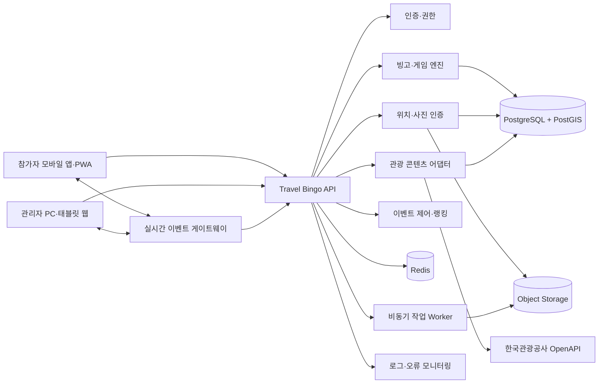

# Travel Bingo 기술계획서

> 문서 버전: v1.1  
> 작성일: 2026-07-16  
> 최종 수정일: 2026-07-29  
> 대상: 2026 관광데이터 활용 공모전 ②-2 웹·앱 구현 부문 출품용 MVP  
> 프로젝트 상태: MVP 구현 진행 중

## 1. 프로젝트 개요

### 1.1 서비스 정의

Travel Bingo는 단발성 명소 방문을 지역과 반복적으로 관계 맺는 여행 경험으로 전환하기 위해, 관광지·전통시장·골목·문화시설·음식점·공원 등을 5×5 미션형 빙고로 구성하는 모바일 중심 웹 서비스이다.

사용자는 대한민국 지도에서 지역을 선택하고, 그 지역에 준비된 역사·공원·카페·자연·야경·맛집·축제 등 여러 개의 5×5 테마 빙고를 플레이한다. 현장에서 GPS·QR·퀴즈·사진으로 미션을 인증하고, 3개 빙고 라인을 완성하면 해당 판을 클리어한다. 테마와 지역의 완료 상태는 지도·여행 기록·업적·랭킹에 누적된다. 지역 운영자는 한국관광공사 관광데이터를 바탕으로 상시 테마 빙고와 기간 한정 이벤트 빙고를 제작할 수 있다.

### 1.2 해결하려는 문제

- 흥미 위주 일회성 관광이 지역과의 지속적인 관계로 이어지지 않는 문제
- 인구 감소 지역에 재방문·장기체류·관계인구를 유도할 지속 가능한 관광 장치 부족
- 관광 정보 탐색과 실제 행동 사이의 단절
- 지역 소상공인·전통시장·문화시설의 낮은 노출
- 체크리스트형 여행 서비스의 낮은 몰입도와 재방문 동기

### 1.3 핵심 가치

- 여행자: 여행 계획을 게임처럼 쉽고 재미있게 실행
- 지역: 관광객 동선을 여러 장소와 업종으로 분산
- 운영자: 공공 관광데이터 기반으로 지역 콘텐츠를 빠르게 구성
- 공모전: 관광 OpenAPI를 서비스 핵심 흐름에 실질적으로 활용

### 1.4 공식 지정과제 선택 및 정합성

**선택 과제 : 4번**
`단순 흥미 위주 일회성 관광의 한계 및 인구 감소 지역의 지속 가능한 생활인구 유입 대책 부족`

Travel Bingo의 해결 논리는 `관광정보 제공 → 지역 미션 수행 → 지역 내 다양한 접점 형성 → 미완료 미션·시즌·업적을 통한 재방문 → 지역 완주와 반복 방문 측정`이다.

| 해결과제의 핵심 | Travel Bingo 대응 |
|---|---|
| 일회성 관광의 한계 | 한 번의 명소 방문이 아닌 여러 개의 5×5 빙고판 구조로 다양한 지역·테마·난이도에 접근할 수 있도록 구성 |
| 지역과의 관계 부족 | 시장·골목·문화시설·공원·음식점 등 생활권 접점 구성 |
| 재방문 동기 부족 | 미완료 칸, 시즌 빙고, 지역 배지, 연속 방문 업적 |
| 체류시간 확대 필요 | 일정과 이동 강도에 맞춘 반일·1일·다회차 빙고 |
| 인구 감소 지역 유입 | 인구 감소 지역 추천 노출 및 지역별 캠페인 운영 |
| 지속 가능성 측정 | 재방문율, 지역 내 인증 장소 수, 체류 세션, 지역 완주율 측정 |


## 2. 목표와 성공 기준

### 2.1 MVP 목표

1. 사용자가 지역·기간·동행·관심사를 선택해 빙고판을 생성한다.
2. 각 칸은 실제 관광 콘텐츠와 연결되고 지도에서 확인할 수 있다.
3. 사용자가 GPS와 사진을 이용해 미션을 인증한다.
4. 서버가 인증 조건을 검증하고 빙고·점수·배지를 계산한다.
5. 운영자가 공식 빙고와 미션을 등록·검수·공개한다.
6. 시연 지역 1곳에서 처음부터 완주까지 안정적으로 동작한다.

### 2.2 정량 성공 기준

| 구분 | 목표 |
|---|---:|
| 빙고 생성 성공률 | 95% 이상 |
| 핵심 API p95 응답시간 | 800ms 이하(외부 API 최초 조회 제외) |
| 캐시된 관광지 검색 p95 | 500ms 이하 |
| 사진 업로드 성공률 | 98% 이상 |
| 위치 인증 오판 방지 | 허용 반경·정확도 기준 서버 검증 100% 적용 |
| 모바일 Lighthouse 성능 | 80점 이상 |
| 핵심 사용자 여정 E2E 통과율 | 100% |
| 시연 중 치명 오류 | 0건 |

### 2.3 비목표(MVP 이후)

- 결제 및 쿠폰 정산
- 실시간 친구 대전
- 전국 모든 지자체용 운영 기능 완성
- 자체 학습한 고정밀 비전 모델 구축(초기에는 외부 비전 모델+규칙+관리자 검수를 조합)
- 네이티브 iOS·Android 앱 동시 출시
- 완전 자동화된 AI 콘텐츠 공개(운영자 검수 없이 게시하지 않음)

## 3. 주요 사용자와 시나리오

### 3.1 여행자

1. 소셜 로그인 또는 게스트 체험
2. 지역, 일정, 동행 유형, 관심사, 이동 강도 선택
3. 추천 공식 빙고 선택 또는 맞춤 빙고 생성
4. 지도와 상세정보를 보며 미션 수행
5. 현장에서 GPS 확인 후 사진 업로드
6. 빙고 완성, 점수·배지 획득, 결과 공유

### 3.2 지역 운영자

1. 지역과 테마 선택
2. 관리자 대시보드의 관광지 추천에서 한국관광공사 OpenAPI 지역·콘텐츠 유형별 후보 조회
3. 대표 이미지·주소·좌표·상세 설명을 비교하고 장소 선택
4. 선택한 장소를 GPS 지역 미션 초안으로 변환
5. 미션 문구·인증 방식·허용 반경·난이도·점수 편집
6. 초안 보관함에서 검토하고 25칸의 장소·유형·난이도 분포 검증
7. 미리보기 후 공식 빙고 공개
8. 참여·인증·완주·장소별 방문 전환 확인

### 3.3 관리자

- 신고 콘텐츠 및 부정 인증 검토
- 운영자 권한 승인
- 관광 콘텐츠 동기화 오류와 외부 API 상태 확인
- 공개 빙고 품질 및 금칙어 관리

### 3.4 사용자 채널 구분

| 채널 | 대상·기기 | 핵심 기능 |
|---|---|---|
| 참가자 앱 | 스마트폰용 모바일 앱 또는 PWA | GPS 미션, QR·퀴즈·사진 인증, 빙고 진행, 지도·나의 순간, 실시간 이벤트 순위 |
| 관리자 대시보드 | PC·태블릿용 반응형 웹 | 이벤트 생성·제어, 실시간 현황, 인증 검수, 참가자 제재, 랭킹 관리, 공지 전송 |

참가자 앱은 현장 사용성, 카메라·위치 권한, 약한 네트워크 대응을 우선한다. 관리자 대시보드는 많은 정보를 동시에 확인하는 표·필터·지도·실시간 현황 중심으로 구성한다. 두 채널은 동일한 API와 인증 체계를 사용하지만 별도 애플리케이션과 역할 권한으로 분리한다.

## 4. 기능 요구사항

### 4.1 우선순위

| 우선순위 | 기능 |
|---|---|
| P0 | 로그인, 대한민국 탐험 지도, 지역별 다중 테마 빙고, 5×5 플레이, GPS·QR·퀴즈·사진 인증, 3빙고 클리어 판정, 지역 진행률, 여행 기록, 운영자 CRUD |
| P1 | AI 사진 자동 판정과 관리자 검수, 기간 한정 이벤트 빙고, 주말·공휴일 동시 시작 이벤트, 업적·배지, 평상시·시즌·누적 랭킹, 공유 커뮤니티, 푸시/알림 |
| P2 | 맞춤 빙고 자동 생성, 친구 랭킹·협동, 쿠폰·리워드, 지역 마켓플레이스, 다국어 |

### 4.2 빙고 생성 규칙

- 기본 크기는 5×5, 중앙 칸은 일반 미션 또는 선택형 보너스 미션으로 구성한다.
- 한 장소가 같은 빙고에 중복 포함되지 않도록 한다.
- 카테고리 편중을 막기 위해 관광지·문화·음식·시장/상점·자연/산책을 균형 배치한다.
- 사용자의 여행 기간과 이동 강도에 따라 장소 간 거리를 제한한다.
- 휴무일, 운영시간, 행사 기간을 확인할 수 없는 콘텐츠는 경고하거나 대체 후보로 낮춘다.
- AI는 미션 문구와 후보 조합을 제안하고, 장소의 식별자·좌표·운영 정보는 관광 API 및 운영자 데이터에서만 확정한다.
- 생성 결과에는 사용한 데이터 출처와 마지막 동기화 시각을 저장한다.

#### 지역 관계 형성 미션 선정 점수

후보 장소의 추천 점수는 아래 항목을 가중 합산한다.

- 사용자 관심사 적합도
- 사용자 일정에 맞는 거리와 예상 이동시간
- 지역 내 체류시간과 접점 수 확대 가능성
- 장소 카테고리 다양성
- 전통시장·골목·지역 문화시설 등 지역 생활권 기여도
- 운영 가능성 및 데이터 완전성

미션 구성은 유명 명소의 수를 늘리는 데 목적을 두지 않는다. 한 지역 안에서 관광·문화·시장·산책·음식 등 서로 다른 생활 접점을 경험하게 하고, 한 번에 모두 끝내도록 강요하기보다 일정별 부분 완주와 다음 방문 이어하기를 지원한다.

### 4.3 미션 인증 방식

| 방식 | 검증 조건 | MVP 적용 |
|---|---|---|
| GPS 도착 인증 | 사용자 좌표와 장소 좌표 간 거리, GPS 정확도, 측정 시각을 서버가 검증한 뒤 자동 완료 | 필수 |
| QR 인증 | 장소에 설치된 서명 QR의 이벤트·미션·만료 정보를 검증한 뒤 완료 | 필수 |
| 현장 퀴즈 | 해당 장소에서만 확인할 수 있는 문제에 정답을 제출하고 위치 조건을 함께 검증 | 필수 |
| 사진 AI 인증 | 원본·촬영시각·중복 해시를 검사하고 비전 모델이 장소·대상·미션 조건 충족도를 판정 | P1 |
| 사진 관리자 검수 | AI 신뢰도가 임계값 사이이거나 신고된 인증을 관리자가 승인·반려 | P1 |
| 복합 인증 | GPS+퀴즈, GPS+사진 등 미션별로 두 가지 이상 조건을 조합 | 선택 |
| 운영자 승인 | 관리 화면에서 증빙 수동 검토 | 예외 처리 |

위치 허용 반경은 장소 특성에 따라 50~300m로 설정한다. 클라이언트 계산 결과를 신뢰하지 않고 서버가 Haversine 거리 계산을 수행한다. 정확도가 지나치게 낮거나 오래된 좌표는 재측정을 요청한다.

사진 AI는 `자동 승인 임계값 이상 → 완료`, `자동 반려 임계값 미만 → 반려`, `중간 신뢰도 → 관리자 검수`의 3단계로 처리한다. 모델 판정만으로 고위험 보상이나 최종 이벤트 순위를 확정하지 않고, 판정 근거·모델 버전·신뢰도·관리자 결정을 감사 이력으로 남긴다.

### 4.4 게임 규칙

- 미션 완료 시 기본 점수와 난이도·지역 가중치를 합산한다.
- 가로·세로·대각선 12개 라인을 서버에서 판정하고, 서로 다른 3개 라인을 완성하면 해당 빙고판을 `CLEAR` 처리한다.
- 이미 보상된 라인은 다시 보상하지 않는다.
- 판정 및 보상은 하나의 데이터베이스 트랜잭션으로 처리한다.
- 지역 완주, 카테고리 누적, 연속 참여 조건으로 배지를 지급한다.
- 하나의 칸이 여러 라인에 포함되는 것은 허용하되, 동일 라인을 중복 집계하지 않는다.
- `3빙고 클리어`와 `25칸 퍼펙트 클리어`를 구분하고 퍼펙트 클리어에는 별도 점수·업적을 지급한다.

### 4.5 주말·공휴일 한정 동시 시작 이벤트

정해진 주말이나 공휴일의 특정 시간대에 참가자들이 동일한 빙고와 규칙으로 동시에 시작하는 한정 이벤트를 운영한다. 평상시의 개인 여행 경험을 해치지 않으면서, 제한된 시간의 경쟁과 특별 보상으로 재접속·재방문 동기를 강화한다.

#### 사용자 흐름

1. 이벤트 시작 전 홈 화면과 알림에서 지역, 시작 시각, 제한시간, 보상을 안내한다.
2. 사용자는 참가 신청 후 시작 대기실에 입장한다.
3. 서버 기준 시작 시각에 모든 참가자의 이벤트 빙고를 동시에 활성화한다.
4. 제한시간 동안 위치·사진 인증으로 미션을 완료한다.
5. 진행 중에는 본인 순위와 상위권 현황을 보여주되, 정확한 위치나 이동경로는 공개하지 않는다.
6. 종료 후 확정 순위, 완료 미션, 달성 시간, 특별 업적·배지를 제공한다.

#### 랭킹 규칙

기본 정렬은 아래 순서를 적용한다.

1. 검증 완료된 미션 수 내림차순
2. 완성한 빙고 라인 수 내림차순
3. 마지막 유효 미션을 완료하기까지 걸린 서버 기준 시간 오름차순
4. 동률이면 이벤트 참가 확정 시각 오름차순

랭킹은 클라이언트 시간이 아니라 서버의 `startedAt`, `verifiedAt`, `endedAt`으로 계산한다. 인증 심사 중인 미션은 잠정 순위에 별도 표시하고, 이벤트 종료 후 검증이 완료되어야 최종 순위와 보상을 확정한다.

#### 특별 성취 예시

- 이벤트 챔피언: 최종 1위
- 스피드 빙고: 가장 빠른 첫 줄 완성
- 지역 탐험가: 서로 다른 카테고리 미션을 가장 많이 완료
- 주말 개척자: 주말 이벤트 최초 참가
- 시즌 완주자: 한 시즌의 이벤트를 지정 횟수 이상 참가
- 꾸준한 여행자: 연속 이벤트 참가

#### 운영·공정성 원칙

- 이벤트별 지역, 참가 정원, 신청 기간, 시작·종료 시각, 빙고 템플릿, 점수 규칙을 버전으로 고정한다.
- 시작 후 템플릿과 배점은 수정하지 않는다. 긴급 중단 시 운영 사유와 보상 정책을 기록한다.
- GPS 정확도, 비정상 이동속도, 동일 사진, 다계정 의심 패턴을 검사한다.
- 경쟁 참여를 원하지 않는 사용자는 일반 빙고를 계속 이용할 수 있다.
- 심야·기상 악화·장소 폐장 등 안전 위험이 있는 시간에는 이벤트를 개설하지 않는다.

#### 관리자 실시간 운영 기능

| 기능 | 동작 |
|---|---|
| 이벤트 생성 | 지역, 빙고 버전, 신청기간, 시작·종료시각, 제한시간, 정원, 순위 규칙, 보상 설정 |
| 시작 | 예약 시각 자동 시작 또는 권한 있는 관리자의 수동 시작. 모든 참가자 세션에 동일한 서버 시작시각 적용 |
| 일시 중지 | 안전사고·서버 장애 시 신규 인증과 타이머를 일시 중지하고 참가자에게 사유 공지 |
| 재개 | 중지 시간을 제외하도록 종료시각과 경과시간을 서버에서 보정한 후 재개 |
| 종료 | 예약 종료 또는 관리자 긴급 종료 후 `VERIFYING` 상태로 전환 |
| 실시간 현황 | 접속자, 참가자, 미션 제출·승인·반려, 지역별 분포, 오류율, 잠정 순위 확인 |
| 인증 검수 | AI 애매 판정·신고·상위권 인증을 우선 검수하고 승인·반려 사유 기록 |
| 참가자 제재 | 경고, 이벤트 실격, 기간 정지, 계정 정지. 사유·증거·처리자·이의제기 상태 기록 |
| 랭킹 관리 | 수동 점수 입력이 아니라 인증 재검토·실격·오류 보정 후 서버 재계산과 최종 확정 수행 |
| 공지 전송 | 전체·특정 이벤트·특정 지역·개별 참가자 대상으로 앱 내 공지와 푸시 발송 |

`시작·중지·재개·종료·랭킹 확정`은 영향이 큰 운영 명령이므로 2차 확인, 역할 권한, 멱등성 키, 감사 로그를 적용한다. 관리자가 순위 숫자를 임의로 수정할 수 없게 하고 모든 변경은 원인이 되는 인증 또는 제재 기록에서 파생되게 한다.

#### 관리자 대시보드 메뉴 구조

| 메뉴 | 하위 기능 | 주요 내용 |
|---|---|---|
| 이벤트 | 생성 | 지역·빙고·기간·정원·규칙·보상·공지 설정 |
| 이벤트 | 수정 | 시작 전 설정 변경, 버전 이력과 변경자 기록 |
| 이벤트 | 삭제 | 미시작 초안은 소프트 삭제, 참가자가 있는 이벤트는 취소·보관 처리 |
| 이벤트 | 예약 | 신청·시작·종료 시각, 자동 시작·종료, 예약 공지 설정 |
| 지역 | 빙고 생성 | 지역별 상시·테마·기간 한정 5×5 빙고 생성 |
| 지역 | 미션 생성 | 제목, 설명, 장소, 점수, 난이도, 인증 정책 설정 |
| 지역 | 관광지 추천 | 한국관광공사 OpenAPI로 지역·콘텐츠 유형별 후보 검색 및 상세 비교 |
| 지역 | 미션 초안 보관함 | 관광지를 GPS 지역 미션 초안으로 변환하고 검토·수정·등록 |
| 지역 | GPS 등록 | 장소 좌표, 허용 반경, 정확도 기준, 안전 안내 설정 |
| 지역 | QR 등록 | 미션용 서명 QR 발급, 유효기간·회전·폐기 관리 |
| 사용자 | 통계 | 가입·활성·재방문·지역·빙고·이벤트 참여 지표 |
| 사용자 | 랭킹 | 평상시·시즌·이벤트 잠정/최종 순위 조회와 재계산 |
| 사용자 | 제재 | 경고, 이벤트 실격, 기간 정지, 계정 정지, 이의제기 처리 |
| 사용자 | 공지 | 전체·지역·이벤트·개인 대상 앱 내 공지·푸시 발송 |
| 사진 | AI 자동 판정 | 승인·반려·애매 판정과 모델 신뢰도·버전 확인 |
| 사진 | 관리자 승인 | 검수 대기열에서 승인·반려·재검토 및 사유 기록 |
| 사진 | 신고 관리 | 신고 접수, 숨김, 복구, 삭제, 사용자 제재 연계 |
| 실시간 | 현재 참가자 | 접속·대기·플레이·종료 참가자 수와 상태 |
| 실시간 | 현재 위치 통계 | 지역·미션 단위 집계 인원과 밀집도, 안전 임계치 알림 |
| 실시간 | 실시간 랭킹 | 검증 상태가 반영된 잠정 순위와 변동 내역 |
| 실시간 | 서버 상태 | API·DB·Redis·스토리지·Worker·외부 API 상태와 오류율 |

현재 위치 통계는 관리자에게 참가자의 정밀 좌표 목록을 상시 노출하지 않는다. 지역·미션 단위로 집계하고 최소 집계 인원 기준을 적용한다. 안전사고 대응 등 정당한 사유로 개별 위치 확인이 필요한 경우에는 제한된 역할, 사유 입력, 짧은 접근시간, 감사 로그를 요구한다.

이벤트와 빙고는 참가·인증·보상 기록이 연결된 이후 물리 삭제하지 않는다. 운영 화면의 삭제는 기본적으로 `ARCHIVED` 또는 `CANCELLED` 상태로 전환하는 소프트 삭제이며, 법정 보존기간 및 개인정보 삭제 정책과 충돌하지 않게 별도 처리한다.

#### 관리자 역할 권한

초기 개발·운영은 1인이 담당하므로 관리자 역할을 세분화하지 않는다. 단일 `ADMIN` 계정이 다음 권한을 모두 가진다.

- 지역·테마·빙고·미션·GPS·QR 관리
- 이벤트 생성·수정·삭제·예약·시작·중지·재개·종료
- 실시간 참가자·위치 통계·랭킹·서버 상태 확인
- 사진 AI 판정 검수와 신고 처리
- 사용자 통계·랭킹·제재·이의제기 처리
- 공지 전송, 시스템 설정, 감사 로그 확인

역할 분리와 2인 승인은 적용하지 않지만, 실수와 계정 탈취 위험을 줄이기 위해 이벤트 중지·종료, 참가자 제재, 최종 랭킹 확정, 대량 공지, 데이터 삭제에는 관리자 비밀번호 또는 MFA 재인증과 실행 직전 2차 확인을 적용한다. 모든 관리자 작업은 대상·사유·변경 전후 상태·처리시각을 감사 로그에 남긴다.

향후 운영 인력이 늘어나면 기존 `ADMIN` 권한을 콘텐츠·이벤트·검수·사용자 관리 역할로 분리할 수 있도록 API 권한 검사는 기능 단위로 구현하되, MVP 관리자 화면에는 역할 관리 기능을 제공하지 않는다.

### 4.6 지역별 다중 빙고

지역은 하나의 빙고판이 아니라 여러 테마 빙고를 담는 상위 단위다. 같은 지역을 다른 관점으로 반복 탐험하게 하여 일회성 방문을 줄인다.

| 지역 | 테마 예시 |
|---|---|
| 안성 | 역사, 공원, 카페, 자연, 야경, 맛집, 축제 |
| 서울 | 궁궐 투어, 남산 투어 |
| 제주 | 우도, 돌하르방 |
| 기타 지역 | 드라마·영화 촬영지 투어, 지역 특화 테마 |

- 각 테마는 독립된 5×5 빙고판과 버전을 가진다.
- 사용자는 지역 내 여러 테마를 동시에 진행하거나 순차적으로 클리어할 수 있다.
- 상시 테마는 특정 주차나 순서에 따라 잠그지 않는다. 사용자가 역사·카페·자연·야경·맛집 등 원하는 테마를 방문 상황과 취향에 따라 자유롭게 고른다.
- 월간 재방문 보상은 특정 테마를 강제하지 않고, 어떤 상시 테마를 수행했는지와 관계없이 서로 다른 날짜의 유효 방문을 기준으로 계산한다.
- 지역 완료율은 공개된 상시 테마의 가중 진행률로 계산한다. 기간 한정 이벤트는 기본 지역 완료율에서 제외해 이벤트 종료 때문에 완료율이 하락하지 않게 한다.
- 운영자는 지역·테마·노출기간·난이도·대상 사용자·인증방식을 설정해 빙고를 생성한다.
- 이벤트 빙고는 벚꽃축제, 광복절, 크리스마스, 불꽃축제, 지역축제처럼 기간을 지정하며 종료 후 기록과 배지는 보존한다.

### 4.6.1 지역 관계 단계와 재방문 보상

지역 관계 단계는 경쟁 등급이 아니라 사용자가 한 지역과 관계를 쌓아온 과정을 보여주는 상태다.

```text
첫 방문자 → 지역 탐험가 → 재방문자 → 지역 단골
```

| 단계 | 조건 예시 | 의미 |
|---|---|---|
| 첫 방문자 | 해당 지역에서 첫 미션 승인 | 지역과의 첫 접점 형성 |
| 지역 탐험가 | 서로 다른 생활권 장소·카테고리의 미션을 지정 수 이상 완료 | 지역을 여러 관점으로 경험 |
| 재방문자 | 서로 다른 날짜에 유효 방문 2회 이상 | 다시 찾을 만큼 의미 있는 경험 형성 |
| 지역 단골 | 최근 지정 기간 동안 반복 방문 조건 충족 | 지역과 지속적인 관계 형성 |

월간·연속 방문 보상 예시는 다음과 같다.

- 한 달에 서로 다른 날짜로 2회 이상 유효 방문: `안성 생활여행자` 배지
- 3개월 연속으로 월별 유효 방문 조건 충족: `안성 단골 탐험가` 배지
- 방문 횟수는 동일 날짜의 반복 인증으로 부풀리지 않고 `RegionVisitSession`을 기준으로 계산한다.
- 사용자가 원하는 테마를 자유롭게 선택해도 방문 관계 단계와 월간 배지를 획득할 수 있다.

`로컬 마스터`는 관계 단계로 사용하지 않는다. 마스터·탐험가·수집가 명칭은 도전 과제를 달성한 업적으로 분리해 `경기도 탐험가`, `벚꽃 수집가`, `역사 마스터`처럼 도감과 프로필에 남긴다.

### 4.6.2 지역 생활권 접점 구성

빙고 미션은 관광지에만 한정하지 않는다. 테마 목적에 따라 전통시장·골목상권·지역 식당·카페·공원·산책로·도서관·미술관·공연장·공방·지역행사 등 주민의 생활권과 맞닿은 장소와 경험을 함께 구성한다.

지역 생활권 미션의 포함 비율은 모든 빙고에 일률적으로 강제하지 않고 테마별 큐레이션 원칙으로 관리한다. 운영자는 빙고 검수 화면에서 관광지·생활권·문화·자연·상권 등 접점 분포를 확인하고, 해당 테마의 취지에 맞게 조정한다.

### 4.7 대한민국 탐험 지도

대한민국 지도는 서비스의 핵심 탐색 화면이자 시간이 흐를수록 완성되는 `내가 다녀온 대한민국 앨범`이다. 각 지역에는 관광지를 대표하는 공식 이미지가 아니라 사용자가 직접 고른 개인적인 추억 한 장인 **나의 순간(My Moment)**을 연결한다. 데스크톱에서는 왼쪽에 지도를 두고 오른쪽에 선택 지역 상세 패널을 표시하며, 모바일에서는 전체 지도에서 지역을 누르면 하단 시트 또는 상세 화면이 열린다.

| 지도 상태 | 색상 | 판정 기준 |
|---|---|---|
| 미방문 | 흰색 | 해당 지역에서 승인된 미션이 없음 |
| 방문 | 노란색 | 승인된 미션이 1개 이상이고 지역 진행률 50% 미만 |
| 탐험 중 | 주황색 | 지역 진행률 50% 이상, 100% 미만 |
| 마스터 | 초록색 | 지역의 필수 상시 테마 빙고를 모두 완료 |

방문하지 않은 지역은 흰색으로 유지하고, 첫 미션을 완료하면 노란색, 지역 진행률이 50% 이상이면 주황색, 필수 빙고를 모두 완료하면 초록색으로 바뀐다. 색상만으로 상태를 구분하지 않도록 패턴·아이콘·텍스트 범례를 함께 제공한다.

지역을 선택하면 다음 정보를 한 화면에 보여준다.

- 지역명과 전체 완료율
- 완료·진행 중·미시작 테마 빙고 목록
- 나의 순간 사진·장소·날짜·한 줄 기록
- 방문 횟수, 첫 방문일, 최근 방문일
- 획득한 지역 배지
- 추억 노트
- 다음 추천 빙고와 최근 여행 기록

예를 들어 안성을 누르면 `완료율 65%`, 역사·공원·야경 완료, 카페·맛집 미완료, 나의 순간 `안성맞춤랜드`, 방문 7회, 첫 방문 `2027-05-12`, 최근 방문 `2028-08-21`, `안성 탐험가` 배지와 “친구들과 처음 안성맞춤랜드에 갔던 날”이라는 기록을 표시한다.

지역 진행률은 단순 방문 수가 아니라 각 테마 빙고의 진행률을 합산해 계산한다. 테마별 진행률은 `검증 완료 칸 수 / 25`를 기본으로 하되, 3빙고 클리어 여부와 퍼펙트 클리어 여부를 별도 표시한다.

#### 지도 표현 모드

1. **탐험 진행 모드**: 행정구역을 흰색·노란색·주황색·초록색으로 채워 전국 진행도를 빠르게 보여준다.
2. **여행 앨범 모드**: 방문 지역의 행정구역 도형 내부를 사용자가 선택한 나의 순간 사진으로 채운다. 서울의 남산타워, 제주의 성산일출봉, 부산의 광안대교처럼 사용자의 각 지역 추억이 지도 위에 남는다.
3. **공유 모드**: 사용자가 공개를 허용한 나의 순간과 지도 완료 상태를 한 장의 이미지로 생성한다. 정밀 위치와 비공개 메모는 제외한다.

지도는 SVG 또는 벡터 타일의 행정구역 식별자를 `Region.administrativeCode`와 연결한다. 앨범 모드는 SVG `clipPath`/`pattern` 또는 동등한 마스킹 방식으로 지역 경계 내부에 리사이즈된 나의 순간 사진을 표시한다. 원본 사진을 지도에 직접 내려보내지 않고 썸네일·WebP 파생본과 서명 URL을 사용한다.

시·군·구 경계 데이터는 출처, 사용 허가, 기준연도와 행정구역 개편 이력을 관리한다. 경계가 변경되더라도 기존 여행 기록은 당시 지역 코드와 현행 지역 코드의 매핑을 통해 보존한다.

### 4.8 여행 기록과 공유 커뮤니티

지역마다 사용자가 가장 마음에 들었던 사진 한 장을 **나의 순간(My Moment)**으로 지정하고 짧은 기록을 남긴다. 이는 지역을 객관적으로 대표하는 사진이 아니라 그 지역에서 사용자가 가장 간직하고 싶은 개인적인 순간이며, 해당 지역 여행 일기의 표지 역할을 한다.

- 나의 순간 사진, 장소명, 촬영일 또는 여행일, 한 줄 기록
- 첫 방문일, 최근 방문일, 방문 횟수
- 완료한 테마와 획득 업적
- 지역 완료율과 대표 인증 장소
- 공개 범위: 비공개, 친구 공개, 전체 공개

나의 순간은 인증 사진 또는 사용자가 추가한 여행 사진 중에서 직접 선택한다. 안성에서 50장의 사진을 남겼다면 그중 한 장과 한 줄 기록을 사용자가 고른다. 언제든 나의 순간을 바꿀 수 있으며 변경 전 사진과 과거 여행 기록은 앨범에 유지한다. 최근 사진·즐겨찾기 사진을 후보로 추천할 수 있지만 최종 선택은 반드시 사용자에게 맡긴다.

방문 횟수는 같은 지역에서 승인된 첫 미션의 날짜를 기준으로 계산하되, 짧은 시간의 반복 인증을 여러 방문으로 부풀리지 않도록 방문 세션 간 최소 간격을 적용한다. 첫·최근 방문일은 승인된 방문 세션에서 파생하며 사용자가 임의 수정한 일기 날짜와 구분한다.

공유 커뮤니티에서는 공개된 지역 기록을 볼 수 있지만 정밀 GPS 좌표, 원본 사진 메타데이터, 실시간 이동경로는 노출하지 않는다. 신고·차단·삭제 요청과 운영자 검수 기능을 제공한다.

### 4.9 업적 시스템

| 범위 | 업적 예시 | 조건 예시 |
|---|---|---|
| 지역 | 안성 탐험가 | 안성의 필수 테마 빙고 100% 완료 |
| 시·도 | 경기도 마스터 | 경기도 내 대상 지역 완료 조건 충족 |
| 전국 | 대한민국 탐험왕 | 17개 시·도 완료 |
| 특별 | 벚꽃 마스터 | 벚꽃 테마 또는 지정 이벤트 조건 완료 |
| 특별 | 야경 수집가 | 서로 다른 지역의 야경 미션 누적 완료 |
| 특별 | 카페 마스터 | 카페 카테고리 미션 누적 완료 |
| 특별 | 역사 탐험가 | 역사 카테고리 미션 누적 완료 |

업적 조건은 코드에 고정하지 않고 조건 DSL 또는 JSON 규칙으로 관리한다. 업적 버전, 유효기간, 대상 지역·테마·카테고리, 필요 횟수, 보상 배지를 운영자가 설정할 수 있게 한다.

### 4.10 랭킹 체계

| 유형 | 운영 방식 |
|---|---|
| 일간 | 매일 초기화되는 미션·점수 랭킹 |
| 주간 | 서비스의 기본 메인 랭킹 |
| 월간 | 한 달 단위 성과 집계 |
| 시즌 | 지정 시즌 동안의 경쟁 결과 |
| 누적 | 전체 기간의 미션·지역·업적 누적 |
| 명예 | 시즌 우승, 특별 이벤트, 퍼펙트 클리어 등 확정 기록 보존 |

모든 랭킹은 전체, 공통, 지역, 친구, 내 지역 범위로 필터링한다. `공통`은 모든 사용자에게 동일하게 제공된 빙고나 미션만 집계하고, `내 지역`은 사용자가 설정한 관심·거주 지역 기준으로 제공한다. 거주 지역은 민감정보가 될 수 있으므로 선택 입력으로 두고 공개하지 않는다.

평상시 랭킹은 검증 완료 미션 수와 점수를 중심으로 계산하고, 실시간 이벤트 랭킹은 완료 미션 수·점수·완료 시간을 이벤트 규칙의 정렬 우선순위로 사용한다. 시즌 종료 후 결과를 고정해 명예 랭킹으로 이관한다.

### 4.11 지역 도감 시스템

도감은 사용자가 다음 여행 목표를 이해하고, 지역·시도·전국 단위의 장기 수집 진행도를 확인하는 화면이다. 업적 목록을 단순 나열하지 않고 `현재 진행도 → 다음 목표 → 획득 보상 → 전시`의 흐름으로 구성한다.

#### 도감 카드 예시

```text
경기도 도감  12 / 31
████░░░░  38.7%

다음 추천 목표
- 평택
- 오산
- 이천

경기도 마스터까지 61.3%
```

- 분자는 완료한 대상 지역 수, 분모는 해당 도감 버전의 전체 대상 지역 수다.
- 행정구역 개편으로 분모가 변할 수 있으므로 도감의 대상 목록과 버전을 저장한다.
- 다음 목표는 미완료 지역 중 현재 위치, 이동거리, 진행률, 시즌 캠페인, 사용자의 관심사를 고려해 최대 3개를 제안한다.
- 지역 상세에서 해당 지역을 완료하면 어느 도감과 업적이 얼마나 진행되는지 즉시 보여준다.

#### 마스터 획득 연출과 전시

- 지도에서 해당 시·도 또는 지역의 테두리를 금색으로 표시한다.
- 프로필 대표 배지 또는 칭호로 설정할 수 있게 한다.
- 프로필의 도감 진열장에 획득일과 함께 영구 보존한다.
- 획득 순간 지도 채색 애니메이션과 축하 카드·공유 이미지를 제공한다.
- 색상·애니메이션만으로 보상을 표현하지 않고 배지명, 아이콘, 텍스트 상태를 함께 제공한다.

금색 테두리는 탐험 진행 색을 대체하지 않고 `MASTER` 상태의 별도 장식 레이어로 렌더링한다. 사용자가 접근성 설정에서 애니메이션 감소를 선택하면 정적인 완료 카드로 대체한다.

#### 프로필 전시

사용자는 획득한 업적 중 최대 지정 개수를 프로필에 대표 업적으로 고정할 수 있다. 다른 사용자에게는 공개로 설정된 나의 순간 지도, 완료한 시·도, 대표 배지, 명예 랭킹 기록만 표시하며 비공개 여행 일기와 거주 지역은 노출하지 않는다.

## 5. 시스템 아키텍처

### 5.1 애플리케이션 구성

```text
apps/
├─ participant/   모바일 앱·PWA
├─ admin/         PC·태블릿 관리자 대시보드
├─ api/           인증·빙고·이벤트·검수·랭킹 API
└─ worker/        사진 AI, 알림, 랭킹 확정, 관광데이터 동기화 작업
```

- `participant`: 모바일 우선 PWA로 시작한다. GPS, 카메라, QR 스캔, 오프라인 임시 저장, 이벤트 순위를 제공한다. 앱스토어 배포가 필요하면 Capacitor 또는 동등한 래퍼로 패키징하되 핵심 도메인 로직과 API는 공유한다.
- `admin`: PC·태블릿 반응형 웹으로 별도 배포한다. 참가자용 화면 코드와 운영 권한 코드를 섞지 않는다.
- `api`: 두 클라이언트에 공통 도메인 API를 제공하고 서버에서 권한·미션 판정·이벤트 상태·순위를 관리한다.
- `worker`: 시간이 오래 걸리거나 재시도가 필요한 사진 AI 판정, 썸네일 생성, 푸시 알림, 랭킹 스냅샷, 관광데이터 동기화를 처리한다.

### 5.2 권장 기술 스택

| 영역 | 기술 | 선정 이유 |
|---|---|---|
| 참가자 프런트엔드 | Next.js 15+, TypeScript, Tailwind CSS, PWA | 모바일 현장 기능과 설치형 웹 경험, 추후 앱 패키징 가능 |
| 관리자 프런트엔드 | Next.js 15+, TypeScript, 반응형 데이터 UI | PC·태블릿용 실시간 운영 대시보드 |
| 서버 API | Next.js Route Handler 또는 NestJS | MVP는 단일 배포, 확장 시 도메인 서비스 분리 가능 |
| 데이터베이스 | PostgreSQL + PostGIS | 관계형 무결성과 위치 반경 검색 지원 |
| ORM | Prisma(PostGIS는 SQL 보완) | 타입 안전한 모델·마이그레이션 |
| 인증 | Auth.js + OAuth | 소셜 로그인과 세션 관리 단순화 |
| 파일 저장 | S3 호환 Object Storage | 인증 사진을 DB와 분리하고 서명 URL 사용 |
| 캐시/작업 큐 | Redis + BullMQ | 관광 API 캐시, 속도 제한, 비동기 이미지 처리 |
| 지도 | Kakao Maps 또는 Naver Maps | 국내 장소 표시와 사용자 친숙도 |
| 대한민국 탐험 지도 | 라이선스가 확인된 행정구역 SVG/GeoJSON + SVG 마스킹 | 지역 상태 색칠, 선택, 나의 순간 앨범 표현 |
| 외부 데이터 | 한국관광공사 관광 콘텐츠 OpenAPI | 관광지·문화시설·축제·음식점·숙박 등 핵심 원천 |
| 배포 | 프런트/서버 컨테이너 + 관리형 PostgreSQL/Redis | 재현 가능한 시연 및 운영 |
| 관측 | Sentry, 구조화 로그, 헬스체크 | 공모전 시연 오류의 빠른 탐지 |

초기 개발 인력이 1~3명이라면 모듈형 모놀리스로 시작한다. 인증, 관광 콘텐츠, 빙고, 인증, 게임화, 운영 도메인의 경계를 코드 수준에서 분리하고 독립 마이크로서비스는 트래픽과 팀 규모가 커질 때 도입한다.

### 5.3 구성 흐름



### 5.3 핵심 설계 원칙

- 외부 API 응답을 화면에 직접 전달하지 않고 내부 표준 모델로 정규화한다.
- 외부 장애 시 캐시된 콘텐츠와 공식 빙고로 플레이가 계속되게 한다.
- 관광 API 키와 지도 키의 서버용 비밀값은 저장소·클라이언트 번들에 포함하지 않는다.
- 빙고 판정, 점수, 인증 결과는 서버를 단일 진실 공급원으로 삼는다.
- PWA 캐시에 진행 중 빙고와 최소 장소 정보를 보관해 약한 통신 환경을 견딘다.

## 6. 관광 OpenAPI 연동 계획

### 6.1 활용 데이터

- 지역·키워드 기반 관광 콘텐츠 검색
- 콘텐츠 유형별 관광지, 문화시설, 축제/공연/행사, 음식점, 숙박 등
- 장소 상세 설명, 주소, 대표 이미지, 좌표, 연락처
- 반복정보·소개정보 등 콘텐츠 유형별 상세 필드
- 변경 또는 신규 관광정보 동기화가 제공될 경우 증분 수집

실제 개발 전 한국관광 콘텐츠랩에서 사용 승인, 호출 규격, 이용량 제한, 표시·저작권 조건을 최종 확인한다. OpenAPI는 공모전용 장식 요소가 아니라 `장소 탐색 → 미션 생성 → 상세 정보 → 지도 표시`의 핵심 데이터 공급자로 사용한다.

### 6.2 어댑터 구조

```text
KtoTourClient
 ├─ searchByArea()
 ├─ searchByKeyword()
 ├─ getDetailCommon()
 ├─ getDetailIntro()
 ├─ getDetailInfo()
 └─ getImages()
          ↓
TourContentNormalizer
          ↓
PlaceRepository (내부 Place 모델)
```

- 외부 `contentId`와 `contentTypeId`를 복합 고유키로 보존한다.
- 좌표, 이미지, 주소, 운영 정보의 출처와 동기화 시각을 기록한다.
- 네트워크 타임아웃은 짧게 설정하고 지수 백오프를 적용한다.
- 조회 결과는 Redis와 DB에 캐시한다. 상세정보는 24시간, 검색 결과는 1~6시간을 기본값으로 하고 공모전 규정과 데이터 특성에 맞게 조정한다.
- 빈 응답·필드 누락·좌표 이상·중복 콘텐츠를 별도 수집 지표로 남긴다.

### 6.3 관리자 지역 미션 제작 보조 도구

한국관광공사 OpenAPI를 참가자 화면의 관광정보 제공뿐 아니라 관리자 대시보드의 `지역 미션 제작 보조 도구`에도 사용한다. 지역 운영자가 모든 장소 정보를 직접 조사하고 좌표를 입력하는 부담을 줄이고, 공신력 있는 관광데이터를 실제 미션으로 전환하는 것이 목적이다.

#### 관리자 작업 흐름

1. 시·도와 시·군·구를 선택한다.
2. `지역 기반 관광정보`로 관광지·문화시설·축제·음식점 등 장소 후보를 조회한다.
3. 필요한 경우 `키워드 검색`으로 후보를 추가 탐색한다.
4. `관광정보 상세 조회`로 대표 이미지, 주소, 좌표, 소개, 운영 관련 정보를 확인한다.
5. 관리자가 장소를 선택하면 내부 `Place`로 정규화하고 지역 미션 초안을 생성한다.
6. 관리자가 제목, 설명, 인증 방식, 허용 반경, 난이도와 포인트를 검토·수정한다.
7. 초안을 저장한 뒤 지역 빙고에 배치하거나 정식 지역 미션으로 등록한다.

#### 화면 구성

| 화면 | 주요 기능 |
|---|---|
| 관광지 추천 | 지역·콘텐츠 유형·키워드 필터, 목록/카드 보기, 대표 이미지와 주소 표시 |
| 관광지 상세 | 소개, 좌표, 이미지, 콘텐츠 유형, 데이터 출처와 마지막 동기화 시각 확인 |
| 미션 초안 편집 | 미션명·설명·유형·인증 방식·GPS 반경·난이도·포인트 편집 |
| 미션 초안 보관함 | 미작성·검토 중·등록 완료 상태 관리, 지역·테마별 필터 |

#### 자동 입력 및 관리자 확정 항목

| 구분 | 자동 입력 | 관리자 확인·수정 |
|---|---|---|
| 장소 정보 | 관광공사 콘텐츠 ID, 명칭, 주소, 좌표, 대표 이미지, 콘텐츠 유형 | 장소 적합성, 최신성, 안전성 |
| 미션 기본값 | 장소명을 활용한 제목·설명 템플릿, GPS 인증 방식 | 최종 문구와 미션 유형 |
| 인증 정책 | 콘텐츠 유형별 기본 허용 반경 | 실제 출입구·현장 환경을 고려한 반경 |
| 난이도·보상 | 이동·인증 복잡도 기반 추천값 | 난이도와 최종 포인트 |

MVP에서는 장소 선택 후 `GPS 지역 미션 초안`으로 변환하는 규칙 기반 기능을 우선 구현한다. 이후 관광지 소개정보를 바탕으로 사진 미션이나 퀴즈 문구를 제안하는 생성형 AI 기능을 추가할 수 있다. AI가 생성한 내용은 바로 공개하지 않고 반드시 관리자 검토를 거치며, 장소 식별자·좌표·주소 등 사실 데이터는 한국관광공사 OpenAPI 또는 관리자 확인값만 사용한다.

미션에는 `source`, `externalContentId`, `sourceUpdatedAt`, `draftCreatedBy`를 저장해 데이터 출처와 생성 이력을 추적한다. 동일한 관광 콘텐츠로 지역 미션을 중복 생성할 때는 경고하되, 서로 다른 테마에서 의도적으로 재사용하는 경우 관리자가 사유를 남기고 허용할 수 있다.

### 6.4 장애 대응

| 장애 | 처리 |
|---|---|
| 외부 API 지연/중단 | 마지막 정상 캐시 제공, 화면에 갱신 시각 표시 |
| 이용량 제한 초과 | 캐시 우선, 요청 병합, 관리자 알림 |
| 이미지 깨짐 | 대체 이미지, 비동기 재확인 |
| 장소 좌표 누락 | 빙고 자동 생성 후보에서 제외, 운영자 보정 허용 |
| 운영시간 불명 | 미션에 정보 확인 필요 표시, 대체 미션 제공 |

## 7. 데이터 모델

### 7.1 주요 엔터티

| 엔터티 | 주요 필드 |
|---|---|
| User | id, role, nickname, status, createdAt |
| Region | id, name, administrativeCode, center, populationDeclineFlag |
| Place | id, source, externalContentId, contentType, title, address, location, imageUrl, sourceUpdatedAt |
| BingoTheme | id, regionId, name, category, isRequiredForRegionCompletion, status, displayOrder |
| BingoTemplate | id, regionId, themeId, title, type, startsAt, endsAt, status, version, ownerId |
| Mission | id, placeId, title, description, category, verificationPolicy, radiusM, points |
| MissionDraft | id, regionId, placeId, sourceContentId, title, description, verificationPolicy, radiusM, difficulty, points, status, createdBy |
| MissionQuiz | missionId, question, answerHash, choices, explanation, version |
| MissionQrToken | missionId, tokenHash, validFrom, validTo, rotationVersion |
| TemplateCell | templateId, missionId, position, sortOrder |
| BingoSession | id, userId, templateId, generatedFrom, status, startedAt, completedAt |
| SessionCell | sessionId, missionSnapshot, position, status, verifiedAt |
| Verification | id, sessionCellId, userId, location, accuracyM, photoKey, status, reason, submittedAt |
| BingoLineReward | sessionId, lineKey, points, awardedAt |
| RegionProgress | userId, regionId, progressPercent, mapStatus, relationshipLevel, firstVisitedAt, lastVisitedAt, visitCount, masteredAt |
| RegionVisitSession | id, userId, regionId, startedAt, endedAt, firstVerificationId, missionCount |
| RegionMonthlyActivity | userId, regionId, yearMonth, validVisitDays, missionCount, conditionMetAt |
| TravelRecord | id, userId, regionId, myMomentId, firstDiaryAt, latestDiaryAt, memoryNote, visibility, updatedAt |
| MyMoment | id, userId, regionId, mediaId, placeId, momentDate, caption, selectedAt, visibility |
| TravelMedia | id, userId, regionId, placeId, sourceType, originalKey, thumbnailKey, capturedAt, moderationStatus |
| RegionBoundaryVersion | administrativeCode, geometryVersion, validFrom, validTo, source, license |
| LiveEvent | id, regionId, templateVersionId, title, registrationOpenAt, startsAt, endsAt, status, capacity, rulesSnapshot |
| EventParticipant | eventId, userId, sessionId, registeredAt, joinedAt, startedAt, status |
| EventLeaderboard | eventId, userId, verifiedMissionCount, lineCount, elapsedMs, provisionalRank, finalRank |
| EventReward | eventId, rewardType, badgeId, rankFrom, rankTo, condition, issuedAt |
| UserSanction | id, userId, eventId, type, reason, evidenceRef, startsAt, endsAt, appealStatus, actorId |
| Notice | id, audienceType, audienceRef, title, body, channels, scheduledAt, sentAt, actorId |
| AdminActionLog | id, actorId, action, targetType, targetId, beforeState, afterState, reason, createdAt |
| Achievement / UserAchievement | 범위, 조건 규칙, 버전, 배지 및 사용자 획득 이력 |
| CollectionBook / CollectionEntry | 도감 버전, 대상 지역 목록, 완료 상태, 진행률, 마스터 획득일 |
| ProfileShowcase | userId, achievementId, displayOrder, visibility |
| RankingSnapshot | scope, periodType, periodKey, userId, missionCount, points, elapsedMs, rank, finalizedAt |
| EventLog | 이벤트명, 사용자/세션, 속성, 발생 시각 |

미션은 운영 중 변경될 수 있으므로 `SessionCell`에 제목·좌표·반경·점수 등 플레이 시작 시점의 스냅샷을 저장한다. 이 방식은 진행 중인 빙고의 규칙이 운영자 수정으로 바뀌는 문제를 막는다.

### 7.2 상태 모델

- 빙고 템플릿: `DRAFT → REVIEW → PUBLISHED → ARCHIVED`
- 플레이 세션: `ACTIVE → CLEAR(3빙고) → PERFECT_CLEAR(25칸) | EXPIRED | ABANDONED`
- 미션 칸: `LOCKED/AVAILABLE → SUBMITTED → VERIFIED | REJECTED`
- 인증: `PENDING → APPROVED | REJECTED | NEEDS_REVIEW`
- 이벤트: `DRAFT → SCHEDULED → READY → LIVE ↔ PAUSED → VERIFYING → FINALIZED | CANCELLED`
- 이벤트 참가: `REGISTERED → READY → PLAYING → FINISHED → RANKED | DISQUALIFIED`

## 8. API 설계

### 8.1 사용자 API 예시

| Method | Endpoint | 용도 |
|---|---|---|
| GET | `/api/v1/regions` | 지원 지역 조회 |
| GET | `/api/v1/map/progress` | 대한민국 지도용 지역별 상태·완료율 조회 |
| GET | `/api/v1/map/album` | 지역별 나의 순간 썸네일과 앨범 지도 데이터 조회 |
| POST | `/api/v1/map/share-card` | 공개 가능한 대한민국 앨범 공유 이미지 생성 |
| GET | `/api/v1/regions/{id}/themes` | 지역의 상시·기간 한정 테마 빙고 조회 |
| GET | `/api/v1/regions/{id}/my-summary` | 완료율·테마·방문·배지·대표 기록 조회 |
| GET | `/api/v1/places` | 지역·키워드·유형별 장소 검색 |
| GET | `/api/v1/bingo-templates` | 공식 빙고 목록 |
| POST | `/api/v1/bingo-sessions` | 공식/맞춤 빙고 시작 |
| GET | `/api/v1/bingo-sessions/{id}` | 현재 판과 진행률 조회 |
| POST | `/api/v1/sessions/{id}/cells/{cellId}/verifications` | 사진·위치 인증 제출 |
| POST | `/api/v1/sessions/{id}/cells/{cellId}/quiz-attempts` | 현장 퀴즈 답안 제출 |
| POST | `/api/v1/sessions/{id}/cells/{cellId}/qr-verifications` | 서명 QR 인증 제출 |
| GET | `/api/v1/users/me/achievements` | 배지·완주 기록 |
| GET | `/api/v1/users/me/travel-records` | 내 지역별 여행 기록 조회 |
| POST | `/api/v1/users/me/travel-records` | 지역 여행 사진·날짜·추억 노트 저장 |
| PATCH | `/api/v1/users/me/travel-records/{regionId}` | 추억 노트·공개 범위 변경 |
| PUT | `/api/v1/users/me/regions/{regionId}/my-moment` | 지역의 나의 순간 사진·장소·날짜·문장 선택 |
| GET | `/api/v1/users/me/collection-books` | 지역·시도·전국 도감 진행도와 다음 목표 조회 |
| PUT | `/api/v1/users/me/profile-showcase` | 프로필에 전시할 대표 업적 설정 |
| GET | `/api/v1/community/travel-records` | 공개 여행 기록 피드 조회 |
| GET | `/api/v1/rankings` | 일간·주간·월간·시즌·누적·명예 및 범위별 랭킹 |
| GET | `/api/v1/events` | 예정·진행·종료 이벤트 조회 |
| POST | `/api/v1/events/{id}/registrations` | 이벤트 참가 신청 |
| GET | `/api/v1/events/{id}/session` | 대기 상태 및 이벤트 빙고 조회 |
| GET | `/api/v1/events/{id}/leaderboard` | 잠정·최종 이벤트 랭킹 조회 |

사진은 서버가 발급한 짧은 수명의 업로드 URL로 Object Storage에 직접 전송한 뒤, 업로드 키와 위치 정보를 인증 API에 제출한다. 서버는 업로드 객체의 크기·MIME·소유자·만료를 확인한다.

### 8.2 운영자 API 예시

| Method | Endpoint | 용도 |
|---|---|---|
| POST | `/api/v1/admin/templates` | 빙고 초안 생성 |
| POST | `/api/v1/admin/regions/{id}/themes` | 지역 테마 생성·노출순서 설정 |
| PATCH | `/api/v1/admin/templates/{id}` | 메타데이터 수정 |
| DELETE | `/api/v1/admin/templates/{id}` | 미사용 초안 삭제 또는 사용 템플릿 보관 |
| PUT | `/api/v1/admin/templates/{id}/cells` | 25칸 편집 |
| POST | `/api/v1/admin/missions` | 장소·점수·인증정책을 포함한 미션 생성 |
| GET | `/api/v1/admin/regions/{id}/tour-recommendations` | 관광공사 지역 기반 관광지 추천 조회 |
| GET | `/api/v1/admin/tour-contents/{contentId}` | 관광지 상세·이미지·좌표 조회 및 내부 표준 모델 반환 |
| POST | `/api/v1/admin/mission-drafts/from-tour-content` | 선택한 관광지를 지역 미션 초안으로 변환 |
| GET | `/api/v1/admin/mission-drafts` | 지역·테마·상태별 미션 초안 목록 조회 |
| PATCH | `/api/v1/admin/mission-drafts/{id}` | 미션 초안 문구·인증정책·난이도·포인트 수정 |
| POST | `/api/v1/admin/mission-drafts/{id}/publish` | 검토된 초안을 정식 지역 미션으로 등록 |
| PUT | `/api/v1/admin/missions/{id}/gps-policy` | 좌표·반경·정확도 기준 등록 |
| POST | `/api/v1/admin/missions/{id}/qr-tokens` | 서명 QR 발급·회전 |
| DELETE | `/api/v1/admin/missions/{id}/qr-tokens/{tokenId}` | QR 폐기 |
| POST | `/api/v1/admin/templates/{id}/validate` | 품질 규칙 검사 |
| POST | `/api/v1/admin/templates/{id}/publish` | 검수된 버전 공개 |
| POST | `/api/v1/admin/events` | 이벤트 일정·규칙·보상 생성 |
| PATCH | `/api/v1/admin/events/{id}` | 시작 전 이벤트 설정 수정 및 버전 기록 |
| DELETE | `/api/v1/admin/events/{id}` | 초안 삭제 또는 이벤트 취소·보관 |
| POST | `/api/v1/admin/events/{id}/schedule` | 검증된 이벤트 예약 |
| POST | `/api/v1/admin/events/{id}/start` | 이벤트 수동 시작 |
| POST | `/api/v1/admin/events/{id}/pause` | 안전·장애 사유로 이벤트 일시 중지 |
| POST | `/api/v1/admin/events/{id}/resume` | 타이머 보정 후 이벤트 재개 |
| POST | `/api/v1/admin/events/{id}/end` | 이벤트 종료 및 인증 검증 단계 전환 |
| GET | `/api/v1/admin/events/{id}/live-status` | 접속·미션·오류·잠정 순위 실시간 현황 |
| POST | `/api/v1/admin/events/{id}/finalize` | 인증 검토 후 최종 순위·보상 확정 |
| GET | `/api/v1/admin/verifications/review-queue` | AI 사진 애매 판정 검수 대기열 |
| POST | `/api/v1/admin/verifications/{id}/decision` | 사진 인증 승인·반려 및 사유 저장 |
| POST | `/api/v1/admin/community/{id}/moderation` | 공개 여행 기록 신고 처리 |
| GET | `/api/v1/admin/photo-reports` | 사진 신고 목록·상태·우선순위 조회 |
| POST | `/api/v1/admin/photo-reports/{id}/decision` | 숨김·복구·삭제·제재 연계 처리 |
| POST | `/api/v1/admin/users/{id}/sanctions` | 경고·실격·정지 등 참가자 제재 |
| POST | `/api/v1/admin/notices` | 대상별 앱 내 공지·푸시 전송 |
| GET | `/api/v1/admin/statistics/users` | 사용자·재방문·빙고·이벤트 통계 |
| GET | `/api/v1/admin/realtime/participants` | 현재 참가자 상태 집계 |
| GET | `/api/v1/admin/realtime/location-stats` | 익명화된 지역·미션별 위치 통계 |
| GET | `/api/v1/admin/realtime/system-health` | 구성요소·외부 API 상태와 오류율 |
| GET | `/api/v1/admin/analytics` | 참여·인증·완주 지표 |

## 9. 맞춤 빙고 생성

### 9.1 입력

- 여행 지역, 날짜·시간대
- 동행 유형(혼자, 친구, 연인, 가족, 부모님, 아이)
- 관심사(자연, 음식, 시장, 문화, 역사, 카페, 축제 등)
- 이동 수단과 강도
- 접근성 요구, 예산 범위

### 9.2 생성 파이프라인

1. 관광 API 및 내부 캐시에서 지역 후보 장소를 조회한다.
2. 좌표·이미지·카테고리·운영 가능성 등 최소 품질 기준을 적용한다.
3. 사용자 조건으로 후보를 점수화한다.
4. 거리, 카테고리 다양성, 난이도, 지역 상권 포함 비율을 제약조건으로 25개를 선택한다.
5. 템플릿 기반 문구 또는 생성형 AI로 미션 문구를 작성한다.
6. 장소 식별자와 사실 정보를 원천 데이터로 재검증한다.
7. 서버 규칙 검사 후 빙고를 저장하고 사용자에게 반환한다.

생성형 AI 호출이 실패해도 규칙 기반 템플릿으로 빙고를 만들 수 있어야 한다. AI가 생성한 문구에는 허위 할인, 폐점 여부, 운영시간 등 검증되지 않은 사실을 추가하지 못하도록 출력 스키마와 후처리 검증을 적용한다.

## 10. 보안·개인정보·부정 사용 방지

### 10.1 보안

- OAuth 세션 쿠키에 `HttpOnly`, `Secure`, `SameSite` 적용
- 사용자/운영자/관리자 역할 기반 접근 제어
- API 입력 스키마 검증 및 사용자 소유권 검사
- 인증·생성·검색 API별 속도 제한
- 비밀키는 환경변수와 배포 환경 Secret Manager에서 관리
- 이미지 업로드 확장자·MIME·용량 제한, 악성 파일 검사
- 관리 기능 감사 로그 보존

### 10.2 개인정보

- 정밀 위치는 인증 순간에만 수집하고 목적·보존기간을 고지한다.
- 원시 위치 이력은 기본적으로 지속 추적하지 않는다.
- 사진 공개 범위는 기본 비공개 또는 결과 카드용 선택 공개로 둔다.
- 얼굴·차량번호 등 민감 요소가 포함될 수 있음을 안내하고 삭제 요청 기능을 제공한다.
- 보존기간 만료 시 원본 사진 및 불필요한 위치 데이터를 삭제한다.

### 10.3 부정 인증 방지

- GPS 정확도, 제출 시각, 비정상 이동속도 검사
- 동일 사진의 해시 중복 검사
- 한 사용자의 짧은 시간 내 과다 인증 제한
- 의심 인증은 `NEEDS_REVIEW`로 전환
- 랭킹 반영 전 인증 상태와 보상 트랜잭션 확인
- 고위험 환경에서는 기기 무결성 신호를 P1으로 추가

## 11. 품질 계획

### 11.1 테스트

- 단위 테스트: 거리 계산, 12개 라인 및 3빙고 클리어 판정, 지도 상태·지역 완료율, 점수, 업적 조건, 이벤트 순위 동률 처리
- 통합 테스트: 관광 API 어댑터, 캐시, DB 트랜잭션, 파일 업로드
- 계약 테스트: 외부 응답 샘플을 고정해 필드 변경 감지
- E2E 테스트: 로그인 → 빙고 시작 → 인증 → 라인 완성 → 결과 확인
- 이벤트 E2E 테스트: 참가 신청 → 동시 활성화 → 인증 → 잠정 순위 → 검증 → 최종 순위·보상
- 관리자 E2E 테스트: 이벤트 생성 → 시작 → 중지·재개 → 종료 → 인증 검수 → 제재 → 랭킹 확정 → 공지 전송
- 인증 E2E 테스트: GPS 자동 완료, QR 위변조 차단, 퀴즈 위치 조건, 사진 AI 승인·반려·관리자 검수
- 앨범 E2E 테스트: 지역 상태 변경 → 나의 순간 선택 → 지도 사진 마스킹 → 비공개 정보 제외 공유
- 도감 테스트: 대상 지역 완료 집계, 다음 목표 추천, 마스터 획득, 금색 장식·프로필 전시
- 재방문 테스트: 동일 날짜 중복 제외, 월 2회 유효 방문, 3개월 연속 조건, 지역 관계 단계 전환
- 동시성 테스트: 이벤트 시작 순간의 세션 활성화, 중복 인증, 랭킹 갱신 부하
- 관리자 보안 테스트: 일반 사용자의 관리자 API 차단, 고위험 명령 재인증·2차 확인, 중복 요청 멱등성, 감사 로그 생성
- 관리자 CRUD 테스트: 이벤트·빙고·미션 수정 이력, 참가 기록이 있는 객체의 소프트 삭제, QR 폐기 즉시 반영
- 실시간 개인정보 테스트: 위치 집계 최소 인원, 정밀 좌표 접근 권한·만료·사유·감사 로그 검증
- 권한 테스트: 일반 사용자의 운영 API 접근 차단
- 성능 테스트: 공개 빙고 조회, 인증 제출, 랭킹 조회
- 현장 테스트: 시연 지역에서 GPS 오차·통신 불안·사진 업로드 확인

### 11.2 완료 조건

- P0 사용자 흐름이 모바일 브라우저에서 동작
- 외부 API 장애 시 공식 빙고 플레이 가능
- 25칸 및 12개 라인 판정 자동 테스트 통과
- 사진·위치 인증의 서버 검증 및 감사 이력 확인
- 개인정보 안내·동의·삭제 경로 제공
- 시연용 계정·빙고·장소 데이터와 장애 대응 시나리오 준비

## 12. 공모전 일정 기반 개발 계획

공식 일정은 접수 `2026-07-06~2026-07-21 16:00`, 예비심사·온라인 OT `7월 말`, 서비스 개발 `7월 말~9월`, 1차·최종심사 `10월 중`, 시상식 `11월 중`이다. 접수 마감까지 완성 서비스 제출이 아니라 신청 내용을 명확히 고정하고, 예비심사 통과 후 공사 OpenAPI를 필수 활용한 완성 서비스를 개발하는 일정으로 운영한다.

| 기간 | 목표 | 산출물 |
|---|---|---|
| 7/16~7/21 16:00 | 접수 완료 | 과제 4 선택, 서비스 정의, 팀원 정보, 신청서 최종 검수 |
| 7월 말 | 예비심사·OT 대응 | 요구사항 확정, 심사 피드백 반영, 기능설명서 골격 |
| 8월 1주 | 기반 구축 | 프로젝트, 인증, DB, CI/CD, 개발·스테이징 환경 |
| 8월 2주 | 관광데이터 연동 | 공사 OpenAPI 어댑터, Place 정규화, 캐시, 지도 |
| 8월 3주 | 미션 추천 엔진 | 지역 접점 점수, 일정·거리·다양성 제약, 다회차 구성 |
| 8월 4주 | 빙고 플레이 | 5×5 UI, 세션, 미션 상세, 추천 동선 |
| 9월 1주 | 현장 인증 | GPS·사진 업로드, 거리 검증, 게임 엔진 |
| 9월 2주 | 이벤트·운영·분석 | 동시 시작 이벤트, 랭킹 확정, 특별 배지, 빙고 편집, 체류·재방문 지표 |
| 9월 3주 | 안정화 | 접근성, 보안, 성능, 외부 API 장애 폴백 |
| 9월 4주 | 제출 빌드 | 현장 테스트, 기능설명서, 시연 계정·데이터, 배포 고정 |
| 10월 | 1차·최종심사 | 기능 시연, PT, 장애 대응용 녹화·로컬 데이터 준비 |

일정이 지연되면 인구 감소 시연 지역 1곳, 지역 접점 25곳과 P0 사용자 여정을 먼저 완성한다. 생성형 AI·랭킹·공유 기능은 기능 플래그로 제외할 수 있게 한다.

## 13. 팀 역할

| 역할 | 책임 |
|---|---|
| 제품/기획 | 지정과제 정합성, 시연 시나리오, 지역 콘텐츠 큐레이션 |
| 프런트엔드 | PWA, 빙고 UI, 지도, 카메라·위치 UX, 운영 화면 |
| 백엔드 | 인증, 데이터 모델, 관광 API, 인증·게임 엔진, 보안 |
| 디자인 | 모바일 UX, 게임 피드백, 결과·공유 화면 |
| 데이터/QA | 장소 품질, 생성 규칙, 테스트, 분석 지표 |

소규모 팀에서는 프런트엔드와 백엔드를 풀스택 1~2명이 맡되, 관광 콘텐츠 검수와 현장 QA 책임자는 반드시 지정한다.

## 14. 운영·분석 지표

### 14.1 제품 지표

- 빙고 노출 → 시작 전환율
- 세션당 미션 인증 수
- 첫 인증까지 걸린 시간
- 1줄 이상 완성률, 전체 완주율
- 카테고리·장소별 방문 전환
- 시내 중심부 외 장소 방문 비율
- 평균 체류 세션 기간 및 재방문율
- 공식 빙고와 맞춤 빙고의 성과 차이
- 이벤트 노출→신청→실참여 전환율
- 이벤트 참가자의 미션 완료 수, 재참여율, 일반 사용자 대비 재방문율
- 잠정 순위에서 최종 순위로 변경된 비율과 부정 인증 적발률
- 지역별 지도 상태 전환율(미방문→방문→탐험 중→완료)
- 테마 시작률, 3빙고 클리어율, 퍼펙트 클리어율
- 여행 기록 작성률, 나의 순간 선택률, 앨범 지도 재열람률, 공개·공유 전환율과 신고율
- 도감 다음 목표 클릭률, 지역 마스터 달성률, 대표 업적 프로필 전시율
- 인구감소지역의 월 2회 이상 방문자 비율과 3개월 연속 방문자 비율
- 첫 방문자→지역 탐험가→재방문자→지역 단골 단계별 전환율
- 테마별 관광지·생활권 장소 미션 구성 및 완료 비율

### 14.2 기술 지표

- 외부 관광 API 성공률·지연시간·캐시 적중률
- 인증 제출 성공률 및 수동 검토 비율
- 이미지 처리 실패율
- API 오류율과 p95 지연시간
- 동기화 시 신규·변경·제외 콘텐츠 수

### 14.3 공식 심사기준 대응

#### 1차 심사

| 공식 항목 | 배점 | 계획서 대응 |
|---|---:|---|
| 서비스 구현성 | 30 | 과제 4 연결 기능의 완결성, GPS·사진 인증, 다회차 5×5 플레이 |
| 서비스 기획력 | 30 | 게임화를 통한 체류·재방문 유도, 명확한 타깃과 차별성 |
| 데이터 활용 적절성 | 20 | 공사 OpenAPI를 장소 탐색·미션 생성·상세·지도에 필수 사용 |
| 서비스 발전성 | 20 | 인구 감소 지역 확장, 지자체 운영도구, 체류·재방문 효과 측정 |

#### 최종 PT 심사

| 공식 항목 | 배점 | 발표 증거 |
|---|---:|---|
| 서비스 적정성 | 30 | 과제 4 문제-기능-성과 지표의 일관된 설명 |
| 서비스 완성도 | 30 | 배포된 서비스, 안정적인 시연, 데이터 출처·갱신·오류 처리 |
| 서비스 실용성 | 25 | 모바일 편의성, 실제 현장 테스트, 지역 운영 활용성 |
| 발표 점수 | 15 | 5분 내 핵심 가치 흐름과 전후 비교를 보여주는 시연 |

1차 심사는 개발 완료 서비스의 기능 심사이므로 화면 목업만으로는 부족하다. 모든 핵심 시나리오는 배포 환경에서 동작하고, 공사 OpenAPI 활용 내역을 코드·화면·기능설명서에서 추적할 수 있어야 한다.

## 15. 주요 위험과 대응

| 위험 | 영향 | 대응 |
|---|---|---|
| 관광 데이터의 누락·오래된 운영정보 | 잘못된 미션 | 공식 빙고 수동 검수, 갱신 시각 표시, 사용자 신고 |
| 외부 API 장애·호출 제한 | 검색/생성 실패 | DB·Redis 캐시, 요청 병합, 공식 빙고 오프라인 제공 |
| GPS 스푸핑·사진 재사용 | 랭킹 신뢰도 하락 | 서버 거리 계산, 해시/속도 검사, 의심 건 검토 |
| 사진·위치 개인정보 우려 | 이탈 및 법적 위험 | 최소 수집, 명시적 동의, 보존기간, 삭제 기능 |
| 25개 미션의 높은 수행 부담 | 완주율 저하 | 1줄 성공을 1차 목표로 설계, 난이도 표시, 대체 미션 |
| AI 환각 | 잘못된 관광정보 | 구조화 출력, 원천 데이터 대조, 규칙 기반 폴백 |
| 범위 과다 | 시연 불안정 | 시연 지역 1곳과 P0 여정 우선, P1 기능 플래그 처리 |

## 16. 공모전 시연 시나리오

1. 사용자가 인구 감소 지역과 이번 방문의 일정·관심사를 선택한다.
2. 서비스가 공사 관광 콘텐츠를 시장·문화·산책·음식 등 지역 접점으로 구성한 5×5 빙고를 만든다.
3. 사용자는 반일 또는 1일 동안 수행할 수 있는 미션 묶음을 선택한다.
4. 각 칸에서 데이터 출처, 사진, 위치, 지역과 연결되는 추천 이유를 확인한다.
5. 현장에서 GPS와 사진으로 미션을 인증하고 한 줄을 완성한다.
6. 완료하지 못한 칸은 다음 방문에 이어서 수행할 수 있게 저장된다.
7. 다음 시즌 미션과 지역 완주 배지가 재방문 동기를 제공한다.
8. 운영 화면에서 지역 내 인증 장소 수, 체류 세션, 재방문율, 완주율을 확인한다.

발표에서는 `공사 관광데이터가 지역 생활 접점 미션으로 변환되고, 한 번의 관광이 체류와 재방문으로 이어지며, 그 관계 형성 행동이 측정되는 가치 흐름`을 강조한다.

## 17. 즉시 실행 항목

1. `2026-07-21 16:00` 이전 한국관광 콘텐츠랩에서 과제 4로 온라인 접수를 완료한다.
2. 팀 대표자는 사전 회원가입을 완료하고, 1차 심사 전까지 최대 5명 이내의 모든 팀원 회원가입·정보 입력을 완료한다.
3. 동일 서비스의 다른 부문 중복 접수·기출품·기수혜 여부를 확인한다.
4. 시연할 인구 감소 지역 1곳과 관광·시장·문화·산책·음식 등 지역 접점 25곳을 선정한다.
5. 한국관광공사 OpenAPI 이용 신청 및 키 발급을 완료한다.
6. 생활인구 선행지표로 사용할 체류·재방문·지역 접점 지표의 정의와 한계를 확정한다.
7. 지도 공급자와 배포 환경을 확정한다.
8. ERD와 OpenAPI 3.1 형식의 서버 명세를 작성한다.
9. 위치·사진 수집 동의 문구와 보존정책을 정의한다.
10. 9월 말 완성 서비스 기준으로 P0 담당자와 주간 완료 기준을 배정한다.

## 18. 참고 자료 및 전제

- 기획 방향: 사용자 제공 ChatGPT 공유 대화 “산책빙고 공모전 조정”
- 해결과제 공식 근거: 사용자 제공 `2026 관광데이터 활용 공모전 ②-2 웹·앱 구현 부문 지정과제 목록` 표의 과제 4 문장
- 일정·참가자격·심사기준 공식 근거: `2026 관광데이터 활용 공모전(웹·앱 구현 부문) 공고문.pdf`
- 관광 콘텐츠 공식 채널: https://api.visitkorea.or.kr/
- 공공데이터포털: https://data.go.kr/
- 공고문 기준 참가자격은 국내 거주자에 한하며 팀당 최대 5명이다. 공사 관광데이터 활용 공모전 수상·지원 수혜 서비스, 동일 서비스의 부문 간 중복 지원, 기존 ②-1 부문에 제출한 동일 결과물 등 공고상 중복 제한을 접수 전에 확인한다.
- 해결과제 해석에는 별도 예시 서비스·해시태그·참고 기능을 사용하지 않는다. 과제 4의 원문만을 기준으로 일회성 관광을 지역 체류·재방문·관계 형성으로 전환하는 독자적인 빙고 서비스를 설계한다.
- 저장소가 비어 있으므로 기술 스택과 일정은 신규 프로젝트 기준의 권장안이다. 기존 조직 표준이나 이미 발급된 인프라가 있다면 해당 표준을 우선한다.
