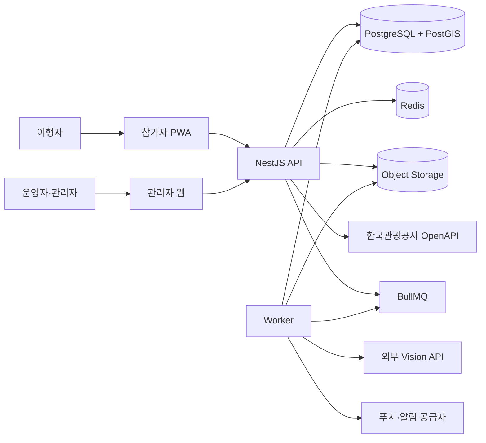
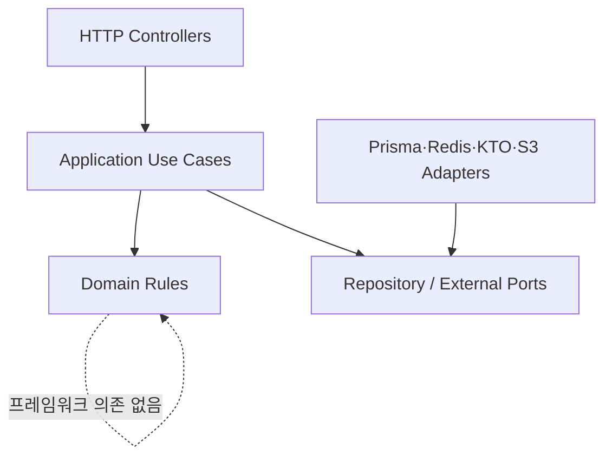
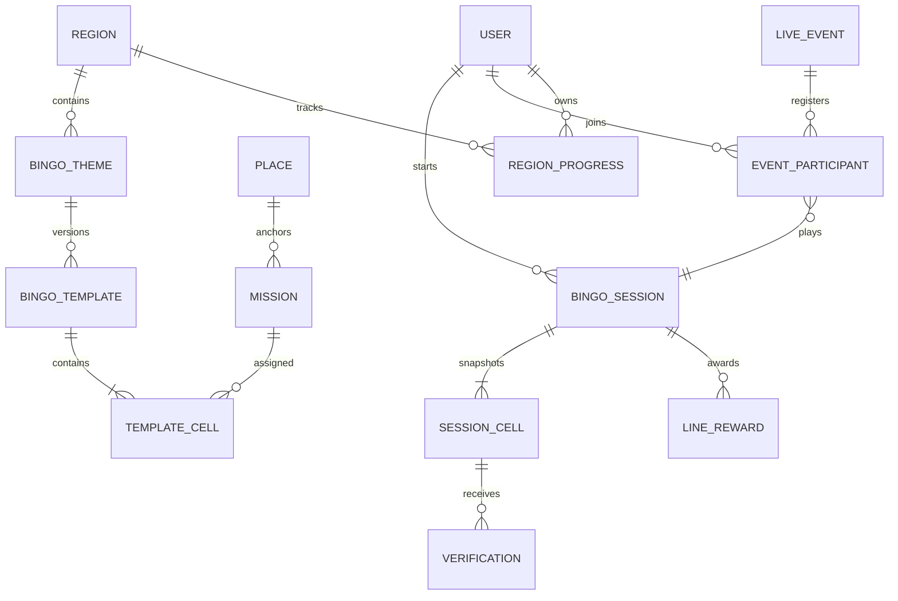
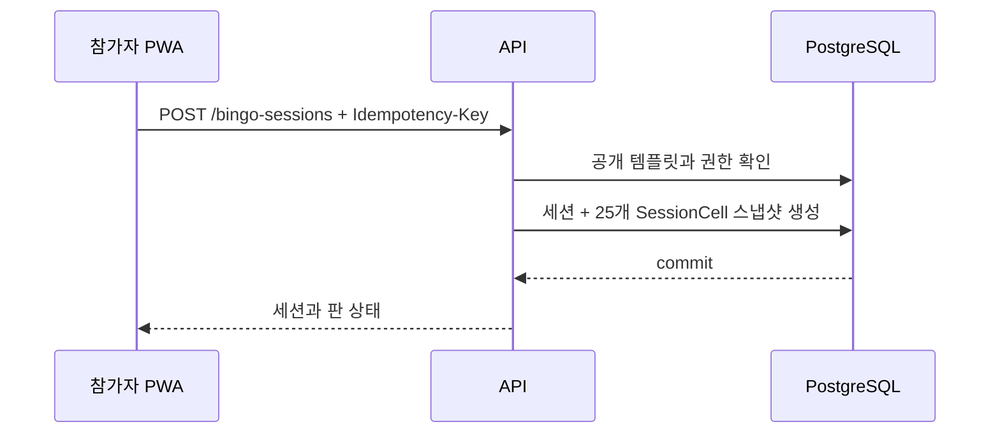
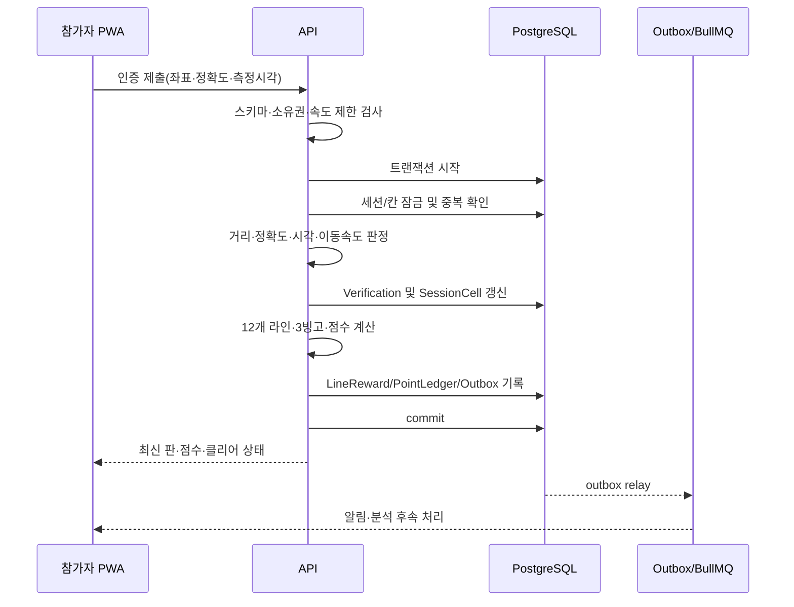
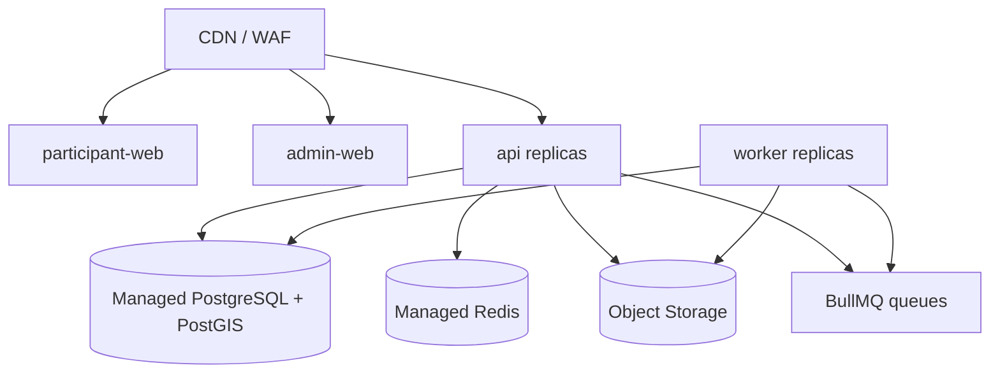

# Travel Bingo 아키텍처 설계서

> 기준 문서: `Travel_Bingo_기술계획서.md` v1.0  
> 설계 기준일: 2026-07-27  
> 대상: 공모전 MVP 및 이후 확장  
> 상태: 구현 기준안

## 1. 설계 결론

Travel Bingo는 **모듈형 모놀리스 + 비동기 Worker**로 시작한다.

- 참가자 PWA와 관리자 웹은 별도 Next.js 애플리케이션으로 분리한다.
- NestJS API가 인증, 권한, 빙고, 인증 판정, 이벤트, 랭킹의 단일 진실 공급원이다.
- PostgreSQL + PostGIS를 기준 데이터 저장소로 사용한다.
- Redis는 캐시, 속도 제한, 짧은 수명의 실시간 상태, BullMQ 작업 큐에만 사용한다.
- 사진은 S3 호환 Object Storage에 직접 업로드한다.
- 외부 관광 API 응답은 내부 `Place` 모델로 정규화한 뒤에만 서비스에서 사용한다.
- 서비스 간 네트워크 분리는 하지 않고 코드의 도메인 경계와 트랜잭션 경계를 먼저 확립한다.

이 구조는 1~3명의 개발 인력으로 9월 MVP를 완성하면서도, 향후 사진 판정·관광 데이터·이벤트를 독립 서비스로 분리할 수 있는 수준의 경계를 제공한다.

## 2. 품질 목표와 설계 대응

| 품질 목표 | 목표값 | 설계 대응 |
|---|---:|---|
| 핵심 API p95 | 800ms 이하 | 외부 API를 사용자 요청 경로에서 분리, Redis 캐시, 쿼리 인덱스 |
| 캐시 관광지 조회 p95 | 500ms 이하 | DB 정규화 저장 + Redis 검색 결과 캐시 |
| 사진 업로드 성공률 | 98% 이상 | Presigned URL 직접 업로드, 재시도 가능한 완료 확인 |
| 위치 판정 신뢰성 | 서버 검증 100% | PostGIS/Haversine, 정확도·측정시각·속도 규칙 |
| 외부 API 장애 대응 | 공식 빙고 플레이 지속 | DB 스냅샷과 stale cache 제공 |
| 중복 보상 방지 | 0건 | 유니크 제약, 멱등성 키, 단일 DB 트랜잭션 |
| 약한 통신 대응 | 진행 손실 최소화 | PWA 로컬 임시 저장, 제출 재시도, 서버 상태 재동기화 |

## 3. 시스템 컨텍스트



### 신뢰 경계

1. 브라우저의 위치·점수·완료 판정은 신뢰하지 않는다.
2. 외부 관광 API와 Vision API 결과는 검증되지 않은 입력으로 취급한다.
3. Object Storage 객체는 API가 발급한 업로드 키, 소유자, MIME, 크기, 만료를 확인한 뒤 연결한다.
4. 관리자 명령도 권한, 재인증, 멱등성 키, 감사 로그를 거친다.

## 4. 컨테이너 구성

```text
apps/
├─ participant-web/       Next.js 참가자 PWA
├─ admin-web/             Next.js 관리자 웹
├─ api/                   NestJS HTTP + SSE API
└─ worker/                NestJS standalone + BullMQ consumer

packages/
├─ api-contract/          요청·응답 스키마, API 타입
├─ domain/                순수 게임 규칙과 값 객체
├─ database/              Prisma schema, migration, SQL
├─ ui/                    공통 디자인 토큰·기초 UI
├─ config/                환경변수 스키마와 공통 설정
└─ observability/         로그, trace, error 공통 코드
```

### 기술 선택

| 영역 | 선택 | 비고 |
|---|---|---|
| 모노레포 | pnpm workspace + Turborepo | 앱별 빌드·캐시 |
| 참가자/관리자 | Next.js 15+, TypeScript | 앱과 권한 코드 분리 |
| API | NestJS REST API | 도메인 모듈, Guard, Interceptor 활용 |
| 실시간 | SSE 우선 | 순위·상태는 서버→클라이언트 단방향이 대부분 |
| ORM | Prisma + 제한적 SQL | PostGIS 공간 쿼리는 SQL repository로 격리 |
| DB | PostgreSQL + PostGIS | 트랜잭션·공간 검색 |
| 비동기 작업 | BullMQ + Redis | 재시도, 지연 작업, DLQ |
| 스키마 | OpenAPI 3.1 + 런타임 검증 | 계약 기반 프런트 타입 생성 |
| 테스트 | Vitest/Jest, Testcontainers, Playwright | 단위·통합·E2E |

WebSocket은 MVP에서 사용하지 않는다. 채팅이나 양방향 협동 기능이 추가될 때 별도 도입한다.

## 5. 백엔드 모듈 경계

| 모듈 | 책임 | 소유 데이터 |
|---|---|---|
| Identity | OAuth 세션, 사용자, 역할, 제재 확인 | User, Account, Session |
| Region | 행정구역, 탐험 상태, 관계 단계 | Region, RegionProgress |
| Tourism | 관광 API 수집·정규화·검색 | Place, PlaceSourceSnapshot |
| BingoCatalog | 테마, 템플릿, 미션, 버전 발행 | BingoTheme, BingoTemplate, Mission, TemplateCell |
| Play | 플레이 세션과 칸 스냅샷 | BingoSession, SessionCell |
| Verification | GPS·QR·퀴즈·사진 제출과 판정 | Verification, Media |
| GameEngine | 라인, 점수, 클리어, 배지 계산 | LineReward, PointLedger, Achievement |
| Event | 이벤트 상태, 참가, 타이머 | LiveEvent, EventParticipant |
| Ranking | 잠정/확정 순위와 스냅샷 | RankingSnapshot |
| TravelLog | 여행 기록, 나의 순간, 공개 범위 | TravelRecord, MyMoment |
| Admin | 검수, 제재, 공지, 감사 | AdminActionLog, Notice, UserSanction |
| Analytics | 제품 이벤트 수집과 집계 | ProductEvent, MetricAggregate |

### 의존 방향



- 다른 모듈의 테이블을 직접 수정하지 않고 해당 모듈의 application service를 호출한다.
- 순수 규칙인 거리 정책, 12개 라인 판정, 점수 계산, 이벤트 정렬은 `packages/domain`에 둔다.
- Controller, Prisma, Redis 객체를 도메인 규칙에 전달하지 않는다.
- 모듈 간 비동기 후속 처리는 outbox event로 연결한다.

## 6. 핵심 데이터 설계

### 6.1 중요 모델 관계



### 6.2 반드시 적용할 무결성 제약

| 제약 | 목적 |
|---|---|
| `Place(source, externalContentId, contentType)` unique | 외부 장소 중복 방지 |
| `TemplateCell(templateVersionId, position)` unique | 한 판의 25개 위치 고정 |
| `TemplateCell(templateVersionId, missionId)` unique | 같은 장소/미션 중복 방지 |
| `SessionCell(sessionId, position)` unique | 세션 스냅샷 무결성 |
| `LineReward(sessionId, lineKey)` unique | 동일 라인 중복 보상 방지 |
| `EventParticipant(eventId, userId)` unique | 중복 참가 방지 |
| `Verification(idempotencyKey, userId)` unique | 재시도 중복 제출 방지 |
| `PointLedger(referenceType, referenceId, reason)` unique | 점수 이중 지급 방지 |

`BingoTemplate`의 공개 버전은 수정하지 않는다. 수정 시 새 버전을 생성한다. `SessionCell`에는 미션 제목, 좌표, 허용 반경, 점수, 인증 정책을 JSON 스냅샷으로 저장해 진행 중 규칙이 바뀌지 않게 한다.

### 6.3 인덱스

- `Place.location`: GiST 공간 인덱스
- `Place(regionId, contentType, status)`: 후보 검색
- `BingoSession(userId, status, updatedAt desc)`: 진행 판 조회
- `Verification(sessionCellId, status, submittedAt)`: 인증 상태
- `Verification(status, riskScore desc, submittedAt)`: 관리자 검수 큐
- `EventParticipant(eventId, status)`: 이벤트 현황
- `RankingSnapshot(scope, periodKey, rank)`: 랭킹 조회
- `ProductEvent(eventName, occurredAt)`: 분석 집계

## 7. 핵심 처리 흐름

### 7.1 빙고 시작



공식 빙고 플레이 경로에서는 외부 관광 API를 호출하지 않는다. 공개 시점에 필요한 장소 정보가 이미 내부 DB와 템플릿 스냅샷에 있어야 한다.

### 7.2 GPS 인증과 게임 판정



판정 트랜잭션은 해당 세션 행을 잠그거나 낙관적 버전 필드를 사용한다. 첫 구현은 단순하고 안전한 `SELECT ... FOR UPDATE`를 권장한다.

### 7.3 사진 인증

1. 클라이언트가 업로드 예약 API를 호출한다.
2. API가 사용자별 경로와 짧은 만료시간의 Presigned URL을 발급한다.
3. 클라이언트가 Object Storage로 직접 업로드한다.
4. 클라이언트가 객체 키, 위치, 촬영 메타데이터로 인증을 제출한다.
5. API가 객체 소유권·크기·MIME을 확인하고 `PENDING`으로 저장한다.
6. Worker가 악성 파일 검사, 해시 중복, 썸네일, Vision 판정을 수행한다.
7. 자동 승인/반려 또는 `NEEDS_REVIEW` 결과를 저장한다.
8. 승인 시 GameEngine을 호출하고 동일한 보상 트랜잭션을 수행한다.

Worker 작업은 최소 한 번 실행될 수 있으므로 작업 ID와 판정 버전을 기준으로 멱등하게 처리한다.

### 7.4 관광 데이터 동기화

```text
Scheduler
  → KTO API client
  → raw response 보관(짧은 기간)
  → schema validation
  → TourContentNormalizer
  → Place upsert
  → 품질 플래그/변경 이력
  → Redis cache invalidation
```

- 검색 결과 캐시 TTL: 1~6시간
- 상세 정보 캐시 TTL: 24시간
- 공식 템플릿은 동기화로 자동 변경하지 않고 운영자에게 차이를 표시한다.
- 외부 장애 시 마지막 정상 데이터와 `sourceUpdatedAt`을 반환한다.
- API 키, 저작권 표시, 이미지 사용 조건은 공급자 정책에 맞춰 별도 설정한다.

### 7.5 이벤트 상태 변경

허용된 상태 전이만 command handler에서 수행한다.

```text
DRAFT → SCHEDULED → READY → LIVE ↔ PAUSED → VERIFYING → FINALIZED
   └──────────────────────────────→ CANCELLED
```

`start`, `pause`, `resume`, `end`, `finalize`는 다음을 공통 적용한다.

- `Idempotency-Key`
- 현재 상태와 version을 이용한 compare-and-set
- 관리자 MFA/비밀번호 재인증 토큰
- 명령 사유
- 변경 전후 상태의 감사 로그
- outbox event

## 8. API 규약

- 경로는 `/api/v1`로 버전 관리한다.
- JSON 필드는 `camelCase`, 시간은 UTC ISO 8601, ID는 UUID를 사용한다.
- 쓰기 API는 `Idempotency-Key`를 지원한다.
- 오류는 Problem Details 형식(`application/problem+json`)으로 통일한다.
- 목록은 cursor pagination을 기본으로 한다.
- OpenAPI 3.1을 소스에서 생성하고 CI에서 호환성 검사를 수행한다.
- 참가자와 관리자 API는 같은 서버를 사용하되 `/admin` 경로와 Guard로 권한을 분리한다.

예시 오류:

```json
{
  "type": "https://travel-bingo.app/problems/location-too-inaccurate",
  "title": "위치 정확도가 낮습니다",
  "status": 422,
  "code": "LOCATION_TOO_INACCURATE",
  "detail": "정확도 80m 이하의 새 위치가 필요합니다",
  "traceId": "..."
}
```

실시간 이벤트 현황은 `GET /api/v1/events/{id}/stream` SSE로 제공한다. 연결이 끊기면 `Last-Event-ID`로 재연결하고, 최종 상태는 일반 조회 API에서 다시 가져온다.

## 9. 캐시와 일관성

| 데이터 | 저장 위치 | 정책 |
|---|---|---|
| 사용자·세션·보상 | PostgreSQL | 강한 일관성 |
| 공개 빙고·장소 | PostgreSQL + Redis | cache-aside |
| 이벤트 잠정 랭킹 | PostgreSQL 기준 + Redis 정렬셋 | 최종 확정 전 재계산 |
| 인증 사진 | Object Storage | DB에는 키와 메타데이터 |
| PWA 진행 정보 | IndexedDB | 화면 복원용, 서버가 최종 기준 |

캐시는 정확성의 근거로 사용하지 않는다. 보상과 최종 랭킹은 항상 PostgreSQL의 승인된 인증으로 재계산한다.

## 10. 보안과 개인정보

### 인증과 권한

- OAuth + 서버 세션 쿠키(`HttpOnly`, `Secure`, `SameSite=Lax`)
- CSRF 방어, Origin 검사, 로그인/인증/검색별 속도 제한
- `USER`, `ADMIN` 역할과 기능 단위 permission 상수
- 관리자 고위험 명령은 짧은 수명의 재인증 토큰 요구
- 모든 객체 조회에 소유권 또는 역할 조건 적용

### 위치와 사진

- 정밀 위치는 인증 요청 시점에만 수집한다.
- 원시 좌표는 정책상 필요한 기간 이후 삭제하거나 제한된 감사 데이터로 축소한다.
- 관리자 실시간 화면에는 최소 집계 인원 이상인 지역·미션 단위 통계만 제공한다.
- 개별 위치 접근은 별도 권한, 사유, 만료시간, 감사 로그를 요구한다.
- 원본 사진은 비공개가 기본이며 전송·저장 암호화를 적용한다.
- 삭제 요청은 DB 레코드 비식별화와 Object Storage 삭제 작업을 함께 생성한다.

### QR

- QR에는 원문 비밀을 넣지 않고 `tokenId`, mission/event, 만료시각을 서명한다.
- DB에는 토큰 해시만 저장한다.
- 회전 버전과 폐기 시각을 검증한다.

## 11. 장애와 복구

| 장애 | 사용자 동작 | 운영 대응 |
|---|---|---|
| 관광 API 중단 | 기존 공식 빙고 계속 플레이 | stale cache, 상태 알림, 재시도 |
| Redis 중단 | 핵심 API는 DB로 제한 운영 | 캐시 miss 허용, 큐 적체 경보 |
| Worker 중단 | GPS/QR은 정상, 사진은 심사 대기 | 작업 재시작, DLQ 재처리 |
| Object Storage 오류 | 업로드 재시도 안내 | 장애율 경보, 만료 URL 재발급 |
| DB 장애 | 읽기/쓰기 실패를 명확히 안내 | 관리형 백업, PITR, 복구 절차 |
| SSE 단절 | polling 또는 재연결 | Last-Event-ID 재개 |

RPO는 15분 이내, RTO는 2시간 이내를 MVP 운영 목표로 둔다. 시연용 공식 템플릿과 핵심 장소 데이터는 별도 seed와 내보내기 파일로 보관한다.

## 12. 관측 가능성

- 모든 요청에 `traceId`, 사용자 익명 식별자, route, latency, status를 구조화 로그로 기록한다.
- 위치 원문, OAuth token, QR 원문, 사진 URL은 로그에 남기지 않는다.
- 핵심 지표:
  - API 오류율과 p50/p95/p99
  - 관광 API 성공률·지연·캐시 적중률
  - 인증 유형별 제출/승인/반려/검수 비율
  - BullMQ 대기 수·실패 수·최고 대기시간
  - 사진 업로드와 처리 실패율
  - 이벤트 SSE 연결 수와 랭킹 갱신 지연
- 인증 제출, 이벤트 상태 명령, 최종 보상에는 도메인 감사 로그를 별도로 남긴다.

## 13. 배포 토폴로지



환경은 `local`, `staging`, `production`으로 분리하고 DB·스토리지·OAuth callback·외부 API 키를 공유하지 않는다. 각 앱은 컨테이너 이미지로 빌드하며 동일 이미지를 staging 검증 후 production에 승격한다.

### CI/CD 게이트

1. lint, typecheck
2. 단위 테스트
3. Prisma migration 검증
4. OpenAPI breaking change 검사
5. Testcontainers 통합 테스트
6. Playwright 핵심 여정
7. 이미지 빌드와 취약점 검사
8. staging 배포·smoke test
9. production 수동 승인

DB migration은 이전 앱 버전과 호환되는 expand/contract 방식으로 작성한다.

## 14. 테스트 전략

| 레벨 | 핵심 대상 |
|---|---|
| 순수 단위 | Haversine, 12개 라인, 3빙고, 점수, 상태 전이, 랭킹 동률 |
| 모듈 단위 | 인증 정책 조합, 템플릿 검증, 권한 |
| 통합 | PostGIS 반경, 중복 인증 동시성, 보상 트랜잭션, outbox |
| 계약 | 한국관광공사 응답 fixture, OpenAPI 클라이언트 |
| E2E | 로그인→빙고 시작→GPS 인증→라인/클리어 |
| 관리자 E2E | 템플릿 발행, 이벤트 시작/중지/종료/확정 |
| 복원력 | 외부 API·Redis·Worker 장애 시 폴백 |
| 현장 | GPS 오차, 느린 통신, 카메라 권한, 업로드 재시도 |

특히 동일 인증 20개 동시 요청, 한 칸을 공유하는 여러 라인의 동시 완성, 이벤트 종료 직전 제출을 동시성 테스트에 포함한다.

## 15. 구현 단계

### 1단계: 기반과 수직 슬라이스

- 모노레포, 환경설정, CI
- User/Region/Place/Template/Session 최소 스키마
- 관리자 seed로 공식 5×5 템플릿 생성
- 참가자 판 조회와 한 개 GPS 인증
- 인증→라인→점수 트랜잭션 테스트

### 2단계: P0 완성

- OAuth, 역할 권한
- 관광 API 정규화·동기화·캐시
- 관리자 미션/템플릿 CRUD와 발행
- GPS, QR, 퀴즈 인증
- 지역 진행률, 여행 기록
- PWA 오프라인 복원과 재시도

### 3단계: 시연 안정화

- Presigned 사진 업로드와 수동 검수
- 관측, 속도 제한, 개인정보 삭제
- 외부 API 장애 폴백과 시연 seed
- Lighthouse, 부하, 현장 E2E

### 4단계: 기능 플래그 P1

- Vision AI 판정
- 동시 시작 이벤트와 SSE
- 잠정/확정 랭킹
- 알림, 공유, 상세 분석

범위가 지연되면 4단계를 끄고, 시연 지역 1곳의 공식 25칸·GPS 인증·3빙고 완주·관리자 편집을 우선 완성한다.

## 16. 아키텍처 결정 기록(ADR)

| ID | 결정 | 이유 | 재검토 조건 |
|---|---|---|---|
| ADR-001 | 모듈형 모놀리스 | 작은 팀, 트랜잭션 중심 도메인 | 팀/트래픽 증가로 독립 배포 필요 |
| ADR-002 | NestJS 전용 API | 두 프런트와 Worker의 명확한 서버 경계 | 단일 Next 앱만 남는 경우 |
| ADR-003 | PostgreSQL + PostGIS | 공간 검색과 보상 트랜잭션 동시 충족 | 없음 |
| ADR-004 | SSE 우선 | 이벤트 상태는 단방향 갱신 중심 | 채팅·협동 제어 추가 |
| ADR-005 | outbox pattern | DB 변경과 후속 작업 유실 방지 | 관리형 CDC 도입 |
| ADR-006 | 공개 템플릿 불변 버전 | 진행 중 규칙 변경 방지 | 없음 |
| ADR-007 | S3 직접 업로드 | API 메모리·대역폭 절감 | 파일 공급자 제약 |
| ADR-008 | P1 기능 플래그 | 공모전 핵심 시연 보호 | P0 안정화 완료 |

## 17. 구현 전에 확정할 항목

아래 항목은 코드 구조를 뒤집지는 않지만 공급자 설정과 운영 정책에 영향을 준다.

1. 시연 지역과 25개 장소
2. 지도 공급자(Kakao/Naver)와 행정구역 GeoJSON 라이선스
3. 배포 클라우드와 S3 호환 스토리지
4. 한국관광공사 API 승인·쿼터·표시 조건
5. OAuth 공급자
6. 위치·사진 보존기간과 삭제 정책
7. P0에서 사진 인증을 수동 검수까지 포함할지 여부

